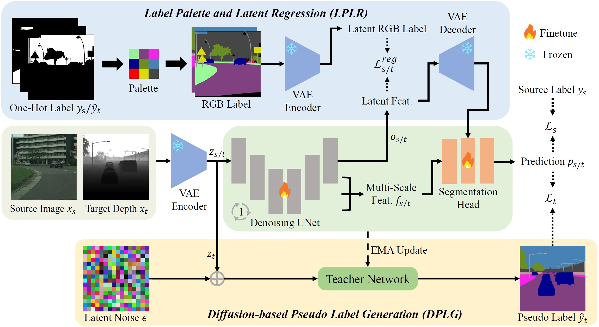
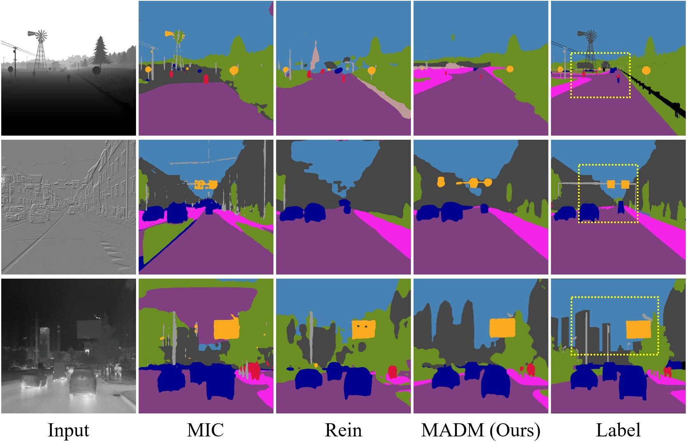

# [2024 NIPS] Unsupervised Modality Adaptation with Text-to-Image Diffusion Models for Semantic Segmentation
by Ruihao Xia, Yu Liang, Peng-Tao Jiang, Hao Zhang, Bo Li, Yang Tang, and Pan Zhou

<div align="center">
<a href="https://arxiv.org/abs/2410.21708"></a>
</div>

## :sparkles: Overview
In this paper, we present Modality Adaptation with text-to-image Diffusion Models (MADM). With the powerful generalization of Text-to-Image Diffusion Models (TIDMs), we extend domain adaptation to modality adaptation, aiming to segment other unexplored visual modalities in the real-world.

<p align="center">
  
<br>
MADM Framework
</p>

## :star: Visual Results
<p align="center">
  
<br>
Qualitative semantic segmentation results generated by SoTA methods MIC, Rein, and our proposed MADM on three modalities.
</p>


## :hammer_and_wrench: Environment Setup
* Create a conda virtual env, activate it, and install packages.

  ```
  conda create -n MADM python==3.10
  conda activate MADM
  conda install pytorch==2.1.1 torchvision==0.16.1 torchaudio==2.1.1 pytorch-cuda=11.8 -c pytorch -c nvidia
  pip install -U openmim
  mim install mmcv==1.3.7
  python -m pip install 'git+https://github.com/facebookresearch/detectron2.git'
  pip install -r requirements.txt
  ```

## :nut_and_bolt: Preparing the Datasets

1. Cityscapes (RGB): Download the gtFine_trainvaltest.zip and leftImg8bit_trainvaltest.zip from [cityscapes](https://www.cityscapes-dataset.com/downloads/). Gererate *labelTrainIds.png via [cityscapesscripts](https://github.com/mcordts/cityscapesScripts/blob/master/cityscapesscripts/preparation/createTrainIdLabelImgs.py). Gerenate `samples_with_class.json` for  rare class sample (RCS) via [Data Preprocessing](https://github.com/lhoyer/DAFormer?tab=readme-ov-file#setup-datasets) in DAFormer.

2. DELIVER (Depth): Download [DELIVER](https://github.com/jamycheung/DELIVER) dataset.

3. FMB (Infrared): Download [FMB](https://github.com/JinyuanLiu-CV/SegMiF) dataset.

4. DSEC (Event): Download [testing semantic labels](https://dsec.ifi.uzh.ch/dsec-semantic/) and [training events](https://drive.google.com/file/d/1dfAchEZVzK8ELZJHdtDiqwhmMSomESZZ/view?usp=sharing) & [testing events](https://drive.google.com/file/d/1dtcdbni82tdRcRvmt3fSKPo7MAc-NvcR/view?usp=sharing) aggregated in the edge form.

5. Modify the project path in line 393 and dataset path in line 394-403 of `main.py`

The data folder structure should look like this:
```
path/to/datasets
├── Cityscapes
│   ├── leftImg8bit
│   ├── gtFine
│   ├── samples_with_class.json
│   ├── ...
├── DELIVER
│   ├── depth
│   ├── semantic
│   ├── ...
├── FMB
│   ├── train
│   ├── test
│   ├── ...
├── DSEC
│   ├── 69mask_train_edges
│   ├── 69mask_test_edges
│   ├── test_semantic_labels
│   ├── ...
```

## :video_game: Training

Following the [examples](https://huggingface.co/CompVis/stable-diffusion-v1-4) in huggingface to automatically download the stable-diffusion-v1-4 model and modify the `stable_diffusion_name_or_path` in `config_files/common/models/mtmadise_multi_lora.py`.

* Training our MADM requires 2 GPUs with greater than 40GB of memory.

1. Cityscapes (RGB) &rarr; DELIVER (Depth)
```
CUDA_VISIBLE_DEVICES=0,1 python main.py --config-file config_files/SemSeg/MTMADISE/mtmadise_cityscapes_rgb_to_depth_11.py --num-gpus 2 --bs 2 --tag RGB2Depth
```

2. Cityscapes (RGB) &rarr; FMB (Infrared)
```
CUDA_VISIBLE_DEVICES=0,1 python main.py --config-file config_files/SemSeg/MTMADISE/mtmadise_cityscapes_rgb_to_infrared_9.py --num-gpus 2 --bs 2 --tag RGB2Infrared
```

3. Cityscapes (RGB) &rarr; DSEC (Event)
```
CUDA_VISIBLE_DEVICES=0,1 python main.py --config-file config_files/SemSeg/MTMADISE/mtmadise_cityscapes_rgb_to_event_11.py --num-gpus 2 --bs 2 --tag RGB2Event
```

## :arrow_forward: Testing

Download the trained model of [Cityscapes (RGB) &rarr; DELIVER (Depth)](https://drive.google.com/file/d/1tDbxc_7yyOSFudyZioZ0bacFabd6h7Pm/view?usp=sharing) or [Cityscapes (RGB) &rarr; FMB (Infrared)](https://drive.google.com/file/d/1wbX5RjFeIcG50uyg2Xr2v41DRxmx3nLf/view?usp=sharing) or [Cityscapes (RGB) &rarr; DSEC (Event)](https://drive.google.com/file/d/15zTldIA-CbYsE9fq8cs5p99ZkmQDWtJc/view?usp=sharing) and put them in the `trained_checkpoints` folder. Then, you can inference with them:

1. Cityscapes (RGB) &rarr; DELIVER (Depth)
```
CUDA_VISIBLE_DEVICES=0,1 python main.py --config-file config_files/SemSeg/MTMADISE/mtmadise_cityscapes_rgb_to_depth_11.py --num-gpus 2 --bs 2 --tag RGB2Depth_eval --eval-only --init-from ./trained_checkpoints/model_RGB2Depth.pth
```

2. Cityscapes (RGB) &rarr; FMB (Infrared)
```
CUDA_VISIBLE_DEVICES=0,1 python main.py --config-file config_files/SemSeg/MTMADISE/mtmadise_cityscapes_rgb_to_infrared_9.py --num-gpus 2 --bs 2 --tag RGB2Infrared_eval --eval-only --init-from ./trained_checkpoints/model_RGB2Infrared.pth
```

3. Cityscapes (RGB) &rarr; DSEC (Event)
```
CUDA_VISIBLE_DEVICES=0,1 python main.py --config-file config_files/SemSeg/MTMADISE/mtmadise_cityscapes_rgb_to_event_11.py --num-gpus 2 --bs 2 --tag RGB2Event_eval --eval-only --init-from ./trained_checkpoints/model_RGB2Event.pth
```

* For the RGB2Infrared and RGB2Event, since previously trained checkpoints are lost, we provide two new checkpoints with similar performance to that in the paper: RGB2Infrared (Original: 62.23, New: 61.88) and RGB2Event (Original: 56.31, New: 56.68).


## :hearts: Acknowledgements

Thanks [ODISE](https://github.com/NVlabs/ODISE), [DAFormer](https://github.com/lhoyer/DAFormer), [Stable Diffusion](https://github.com/CompVis/stable-diffusion), [Detectron2](https://github.com/facebookresearch/detectron2), and [MMCV](https://github.com/open-mmlab/mmcv) for their public code and released models.


## :black_nib: Citation

If you find this project useful, please consider citing:

```bibtex
@article{MADM,
  title={Unsupervised Modality Adaptation with Text-to-Image Diffusion Models for Semantic Segmentation},
  author={Xia, Ruihao and Liang, Yu and Jiang, Peng-Tao and Zhang, Hao and Li, Bo and Tang, Yang and Zhou, Pan},
  journal={arXiv:2410.21708},
  year={2024}
}
```